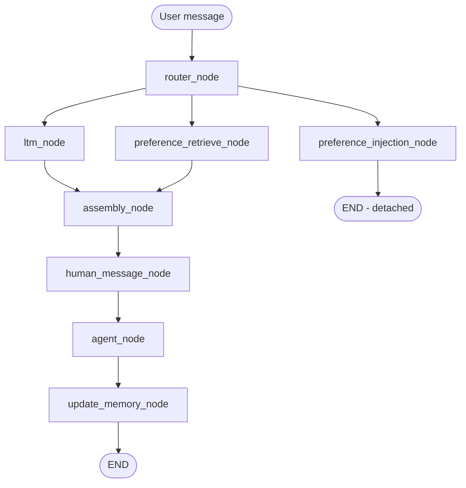
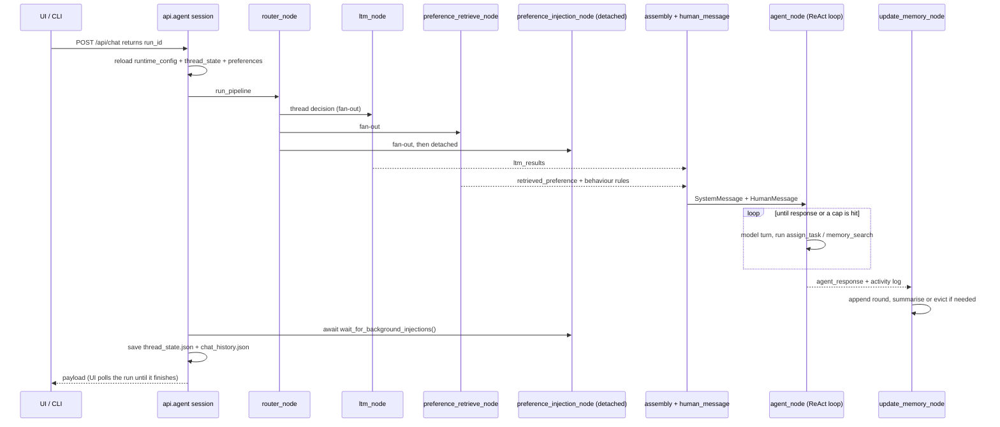
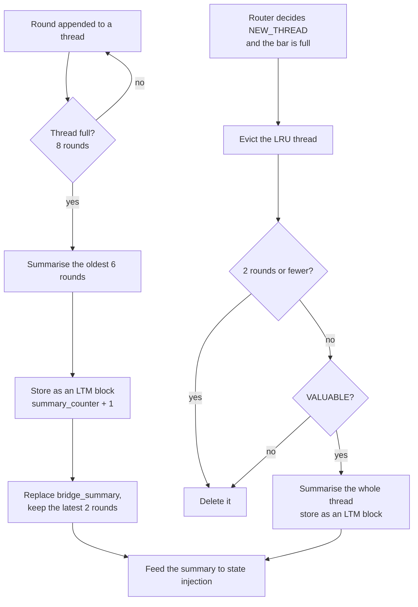
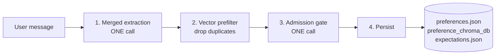
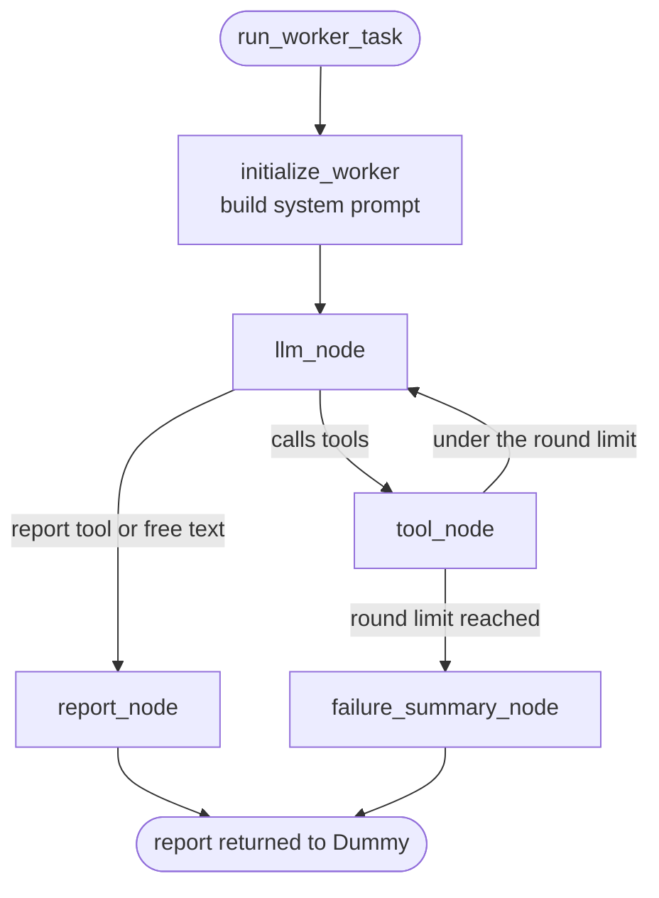

# Architecture Documentation

This document explains how Dummy actually works: the three systems it is built from, the pipeline that connects them, and other components of the system. It is a companion to the README, which covers what Dummy is and how to run it, and to `docs/project-symbol-index.md`, which indexes classes, functions and constants file by file.


## 1. Design overview

Dummy is an agentic system built on LangChain / LangGraph. Its structure is organised as three systems, plus one pipeline that connects them:

| System | Location | Responsibility |
|---|---|---|
| Memory | `memory_backend/` | Conversation memory: short-term threads and long-term summaries |
| Preferences | `preference_system/` | What Dummy knows about the user: notes, expectations, ongoing states |
| Execution | `execution/` + `tool/` | Worker agents and the tools they run |
| Pipeline | `workflow/` | The LangGraph spine that runs one round per user message |

Two principles run through most of the design.

**1. Never flood the model context.** The main agent should receive *relevant* context, not *all* context. So the conversation is split into threads and only the routed thread gets injected; long-term memory is retrieved by similarity and score-gated; preference data passes a retrieval branch before it is shown; and a worker reports back a summary of its work rather than every tool call it made. The trade-off is that each of those filters is an LLM decision that costs some latency and more importantly can be wrong - which is why the router, the retrievers and the admission gate all exist, and why a single round makes several small model calls before Dummy says anything.

**2. Fail soft, but never lose data quietly.** Every store is a JSON file or a ChromaDB collection that may be missing or corrupt. A missing file yields an empty but valid default. A corrupt file is *quarantined* - moved aside to `<name>.corrupt-<utc-timestamp>` - and an empty default is used in its place instead of overwriting it. A fresh clone therefore starts clean, and a bad write cannot destroy the only copy.

Three smaller assumptions shape the code:

- **One round at a time.** The pipeline can only handle one user message at a time, no new user input allowed while system processing; a request can be cancelled through `workflow/run_control.py`.
- **web UI and CLI share same backend code** The web UI and the CLI REPL drive the same pipeline through the same entry point (`workflow.graph.run_pipeline`); the UI only adds async runs, cancel button, and some more convenient GUI interactions.
- **Swappable models, but only tuned for one.** Every model is set up through `init_chat_model`, but several settings assume a DeepSeek-compatible endpoint (see section 10).

## 2. At a glance

### 2.1 Where the state lives

| Path | Holds |
|---|---|
| `preferences.json` | The `PreferenceStore`: note categories with their notes, plus ongoing states |
| `expectations.json` | Conditional expectations (`trigger`, `action`, `expectation_content`) |
| `agent_general_behavior_guide.json` | "Always" expectations - the behaviour rules prepended to every prompt |
| `thread_state.json` | The persisted `ThreadBar`: active threads, their rounds, bridge summaries and LTM references |
| `chat_history.json` | The web UI scrolling history (the last 30 rounds) |
| `runtime_config.json` | Overrides edited from the UI: main-model settings and the general limits below |
| `chroma_db/` | LTM summary blocks (collection `ltm_summaries`), embedded locally |
| `preference_chroma_db/` | Preference notes (collection `preference_notes`), used for duplicate detection |
| `uploads/` | Staged uploads and their parsed parts, keyed by `upload_id` |
| `Dummy_Folder/` | The filesystem and shell sandbox root - everything the worker is allowed to touch |

`preferences.json`, `runtime_config.json` and `agent_general_behavior_guide.json` are tracked in git because they double as working defaults. Session data (`chat_history.json`, `thread_state.json`, `expectations.json`) and the stores are gitignored and rebuilt on first use.

### 2.2 Limits and defaults

These are the numbers that actually shape behaviour. They live in `config.py`; the ones marked *(runtime)* can be edited live from the General tab in the UI and are persisted to `runtime_config.json`.

| Constant | Default | Controls |
|---|---|---|
| `MAX_MESSAGES_PER_THREAD` | 8 | Rounds in a thread before it is summarised *(runtime)* |
| `MAX_ACTIVE_THREADS` | 5 | Threads the `ThreadBar` keeps before the least recently used one is evicted *(runtime)* |
| `BRIDGE_SUMMARY_WORD_LIMIT` | 150 | Length of a thread's bridge summary *(runtime)* |
| `LTM_RETRIEVE_K` | 3 | Long-term-memory blocks retrieved per round *(runtime)* |
| `LTM_SCORE_THRESHOLD` | 0.7 | LTM hits scoring at or above this are discarded *(runtime)* |
| `LTM_LATEST_K` | 2 | Size of the per-thread `latest_ltm` reference cache *(runtime)* |
| `WORKER_ROUND_LIMIT` | 8 | Tool calls a worker may make before the task fails *(runtime)* |
| `MAX_ASSIGN_TASKS` | 8 | `assign_task` calls the main agent may make per round *(runtime)* |
| `MAX_MEMORY_SEARCH` | 5 | `memory_search` calls the main agent may make per round *(runtime)* |
| `TOOLMESSAGE_LIMIT` | 40000 | Characters kept from a single tool result before truncation *(runtime)* |
| `MAX_CHAT_HISTORY_ROUNDS` | 30 | Rounds kept for the UI history panel |
| `NOTE_MAINTENANCE_THRESHOLD` | 20 | Notes in one category that trigger maintenance |
| `MAX_STATES` | 10 | Ongoing states kept before the oldest is dropped |
| `EXPECTATION_LIMIT` | 20 | Conditional expectations before Dummy starts warning the user |
| `BEHAVIOR_GUIDE_LENGTH_LIMIT` | 3000 | Behaviour-guide length before it warns |
| `MAX_REFERENCES` | 3 | Earlier rounds one message may refer back to (API layer) |
| `EMBEDDING_MODEL_NAME` | `all-MiniLM-L6-v2` | The local embedding model both vector stores use |

## 3. The main pipeline

### 3.1 The graph

`build_pipeline_graph()` in `workflow/graph.py` wires eight nodes over `PipelineState`; `run_pipeline()` compiles the graph and runs it with `await compiled.ainvoke(initial_state)`.



Three details of the shape matter later:

- **The router fans out to three branches.** `ltm_node` and `preference_retrieve_node` both feed `assembly_node`, so they run concurrently and assembly waits for both.
- **`preference_injection_node` is detached.** It has no edge into assembly - it ends the graph on its own branch. Extracting and storing new preferences is slow, and nothing downstream needs the result this round, so it just runned in background, while awaited later, before the round is persisted (see 4.4).
- **After assembly the graph is strictly sequential:** system message, human message, agent, memory update.

### 3.2 What travels between the nodes

`PipelineState` is the object every node reads from and writes into; LangGraph merges each node return value into it. A handful of fields carry meaning between systems:

| Field | Meaning |
|---|---|
| `user_message` | The input, plus the attachment manifest (9.2) |
| `router_result` | The matched thread id, or `NEW_THREAD` |
| `thread_for_context` | Extra threads whose context should be pulled in |
| `ltm_results` | The long-term memory hits for this round |
| `retrieved_preference` | The preference context block |
| `general_behavior_expectation` | The always-on behaviour rules, as prompt text |
| `agent_response` | Dummy's final reply |
| `underlying_content` | The activity log stored with the round |

The rest of the object is plumbing - the stores, the message list, the toolkit - passed along so each node can reach what it needs.

One distinction worth holding on to: `user_message` and the human message are not the same thing. The human message is what Dummy reads; `user_message` is what the subsystems around Dummy see.

### 3.3 The nodes

| Node | Defined in | Job |
|---|---|---|
| `router_node` (async `arouter_node`) | `memory_backend/memory_node.py` | Route the message to a thread, or start a new one |
| `ltm_node` | `memory_backend/memory_node.py` | Vector-search long-term memory |
| `preference_retrieve_node` | `preference_system/graph_nodes.py` | Run the preference retrieval branch |
| `preference_injection_node` | `preference_system/graph_nodes.py` | Extract and store new preferences, detached |
| `assembly_node` | `workflow/graph.py` | Build the `SystemMessage` |
| `human_message_node` | `workflow/graph.py` | Build the `HumanMessage` |
| `agent_node` | `workflow/graph.py` | The main-agent ReAct loop |
| `update_memory_node` | `memory_backend/memory_node.py` | Close the round; summarise and evict as needed, also trigger preference.state injection if summarise happened|

## 4. One complete round

### 4.1 What happened after 'send message' clicked

**1. Before the round starts.** The session re-reads `runtime_config.json`, `thread_state.json` and `preferences.json` at the top of every round, so edits (made in the UI or by hand) take effect without restarting anything. It then calls `begin_run()` to reset the cancellation token. In the web UI a round is a *run*: `POST /api/chat` returns a `run_id` immediately, and the UI polls `GET /api/chat/runs/{run_id}`. The CLI calls the same pipeline synchronously and just waits.

**2. `router_node`.** Decides which recent thread this message belongs to, or `NEW_THREAD`. It can also decide to pull in an extra thread: `thread_for_context` for an explicit cross-thread reference, and `retrieve_with_last_round` for preference retrieval. This is the highest-stakes decision in the round, because everything downstream is assembled around its answer (see 6.4).

**3. Three branches, two of them concurrent.**

- `ltm_node` The node performs similarity search to user message. It searchs the long-term-memory vectorstore`chroma_db/`, and return top fits LTM summary blocks that pass the score gate - up to `LTM_RETRIEVE_K`.
- `preference_retrieve_node` runs the retrieval branch over notes, expectations and states, producing `retrieved_preference`, and loads the always-on behaviour rules into `general_behavior_expectation`.
- `preference_injection_node` fires off a detached task that extracts new preferences from this message and stores whatever survives the admission gate. This branch ends immediately.

**4. `assembly_node`.** Wires the earlier node outputs into one `SystemMessage`; the sections it contains are listed in 4.3.

**5. `human_message_node`.** builds User message and any processed file or image into one `HumanMessage`.

**6. `agent_node`.** The main-agent ReAct loop (details in section 5). It is initially invoked on SystemMessage and HumanMessage returned by assembly_node and human_message_node. The agent can call `assign_task` and `memory_search` repeatedly, seeing each result (appended as ToolMessage) as it re-invoked and deciding again, until it calls `response` or emits plain text with no tool call as the response to user.

**7. `update_memory_node`.** Appends the round (user message, agent response, activity log) to the routed thread, and manages `ThreadBar`, so number of total thread and each thread's length are under control. If threadbar too crowded or single thread is too long (evaluated after new round appended), summary process is triggered to store meaningful conversation into LTM vectorstore as embedded summary block (see 6.3 and 7.4).

**8. After the graph ends.** The session awaits the detached preference-injection task, then persists `thread_state.json` and appends the round to `chat_history.json`. Only then the final response form is returned to user.

### 4.2 The round as a sequence



### 4.3 What the assembled prompt looks like

`assembly_node` returns one `SystemMessage`. Its sections, in order:

| Section | Carries |
|---|---|
| current time line | local time, date, weekday and timezone, so Dummy knows when it is being invoked |
| `SYSTEM_INSTRUCTIONS` | Dummy's core prompt - persona, how to use `assign_task`, how a round ends, and the list of available tool categories |
| `=== Long-Term Memory Context ===` | the LTM blocks that survived the score gate, each tagged `[thread, block#, score]` |
| `=== Recent Rounds from Related Thread ===` | the last 2 rounds of a thread pulled in through `thread_for_context` |
| `=== Summary of early part of current conversation ===` | the routed thread's `bridge_summary` |
| `=== Current Conversation ===` | the routed thread's recent rounds (STM), activity logs included |
| retrieved preference block | the notes, states and expectations selected this round, marked *reference only* |
| behaviour rules | the always-on expectations from `agent_general_behavior_guide.json` |

The user side follows separately as a `HumanMessage`, built by `human_message_node` from the typed text plus any processed attachments (9.2).

### 4.4 One round at a time

Dummy currently assumes that only one round is running at a time. This is not
strictly enforced, but some parts of the system rely on this assumption. For
example, the cancellation token in `workflow/run_control.py` is shared across
the whole module and is reset whenever a new round starts.

Cancellation is also not immediate. If a model or tool call is already
running, Dummy waits for it to finish and stops at the next step instead.

## 5. Dummy (Main Agent) ReAct Loop

### 5.1 The loop

`agent_node` runs a plain ReAct loop:

1. Check for cancellation.
2. Call the model with the accumulated messages.
3. If it made no tool calls, its text *is* the reply and the round ends.
4. If it made tool calls, execute them, append a `ToolMessage` with each result, and go back to step 1.

Dummy is given 3 tools - It is capable 3 high-level actions - declared in `tool/agent_tools.py`:

| Tool | Arguments | What it does |
|---|---|---|
| `response` | `report` | Deliver the final reply and end the round |
| `assign_task` | `context_explain`, `instruction`, `assigned_tool_category` | Delegate work to a worker sub-agent running one tool category |
| `memory_search` | `questions`, `search_user_preference`, `search_long_term_memory` | query the memory and preference vectorstores with questions|

**These three tools are schema-only.** Their function bodies are never executed - `agent_node` intercepts the model tool calls and implements the real behaviour itself. They are declared as tools purely so the model sees the correct signatures and descriptions through `bind_tools`.

If Dummy choose `response`, it signals its task is complete and the loop exit with its input to response as the agent response to user. Any tool 
calls after `response` taken will be skipped.

Two caps keep Dummy from looping endlessly: `MAX_ASSIGN_TASKS` (8) and `MAX_MEMORY_SEARCH` (5) per round. Hitting one is not treated as an error - a `ToolMessage` tells Dummy it has run out and should respond with what it has. That keeps the model in charge of wrapping up, instead of the framework cutting it off mid-thought. There is also a hard safety net: once the number of model turns exceeds `MAX_ASSIGN_TASKS + MAX_MEMORY_SEARCH + 3`, the loop is abandoned and a canned "hit my task limit" reply is returned. (Usually it shouldn't be triggered, but serve as a hard safety check)

### 5.2 The activity log

The activity log preserves details of Dummy's actions.
Every tool call and its result are written into the text log, and the log becomes the round `underlying_content`:

```text
[Agent Note] <Dummy's side note while taking action>
[Agent Assign task] | assigned tool category: ... instruction: ...
[Agent Memory Search] | preference: True | ltm: True | questions: [...]
<the worker's report>
```
Activity log is more important than it sounds as it is stored with the round in stm. It is how Dummy able to preserve and recall its thoughts, taken actions, information retrieved over short-term conversation. It is also what revealed when the web UI 'detail view' is clicked, so user can also inspect the execution history of Agent. And inspect results from each specific action.

### 5.3 assign_task: reaching the execution system

`assign_task` is how Dummy acts on the world. Dummy cannot see or call a single tool itself - it only knows the names of the tool categories. So it describes what it wants: `context_explain` (why, and the goal), `instruction` (what to do, and what counts as done), and `assigned_tool_category` (which category should handle it).

That spawns a worker sub-agent, which receives the tools of that category and runs its own ReAct loop until it has something to hand back. The worker's report returns to Dummy as a `ToolMessage`, so Dummy keeps the big picture: it decides what to do next, assigns more work, or responds.

The execution system itself - workers, categories, the report contract - is section 8.

### 5.4 memory_search in detail

`memory_search` allows Dummy to "recall" conversation or user info by asking questions. Vector search is performed on each question provided against requested source (note vectorstore, ltm vectorstore, or both). Relevant contents will be returned as a single ToolMessage text report.

It allows Dummy to actively utilize preference and memory system, when it's lacking specific user/conversation info or when the automatic context pipeline failed its purpose.

## 6. Memory system

Dummy memory is two layers with a one-way handoff between them:

- **STM (short-term)** - a thread bar storing a set of conversation *threads*, each holding the recent rounds of one topic. This is what the agent actually talks with.
- **LTM (long-term)** - a vector store of *summary blocks*, distilled from threads that got too full or too old to keep.

Nothing moves from LTM back into STM. A thread is summarised, the summary is stored, and the rounds are dropped - afterwards that history is only reachable by similarity search.

### 6.1 STM structure

STM is build with 3 hierarchical object classes, all live in `memory_backend/models.py`:

| Object | What it is |
|---|---|
| `ConversationRound` | One exchange: the user message, Dummy's reply, and the activity log from that round |
| `Thread` | One conversation : list of related conversation rounds, a bridge summary from older history, a topic description, and a small cache of the LTM blocks from last active |
| `ThreadBar` | The container of active threads, capped at `MAX_ACTIVE_THREADS` (5) |

A thread can holds up to `MAX_MESSAGES_PER_THREAD` (8) rounds of conversation - above the limit will triggers the handoff in 6.3. `ThreadBar` itself is simple: add, remove, look up, find the least recently used, find the most recent. The policy about *when* to summarise and *when* to evict lives in the nodes, not in the container.

### 6.2 How a ConversationRound is rendered
A conversation round is rendered as format below:

```text
===== Conversation round | 2026-09-10 18:03 Thursday (2 hours ago) =====
[USER]
<the user message>

[ASSISTANT]
<the reply>

[UNDERLYING CONTENT] (only exist if rendered as STM context)
```

Each round carries local time plus a relative age, so the model can judge recency without doing date arithmetic. Rounds can be rendered with or without their activity log - STM context includes it, which is how Dummy remembers *what it did*, not just what it said.

### 6.3 Short-term to long-term: rolling summarisation & Eviction

Rolling summarisation:

Trigger: a thread reaches 8 rounds. `rolling_summarize()` in `memory_backend/compression.py` then:

1. Takes the earliest 6 rounds (`MAX_MESSAGES_PER_THREAD - 2`).
2. Asks the model for a single paragraph of at most `BRIDGE_SUMMARY_WORD_LIMIT` (150) words.
3. Upserts that text into the LTM store as a new block for this thread, numbered `summary_counter + 1`.
4. Replaces the thread `bridge_summary` with the new summary and bumps `summary_counter`.
5. Drops those 6 rounds, keeping only the latest 2 in the thread.
6. Regenerates `topic_description` from the raw conversation, so a drifting topic follows.

The design is intended to maintain STM consistency, so a summarization wouldn't cause agent to suddenly lost all stm about an active conversation : the latest 2 rounds stay live, the older content stay in stm as bridge_summary, and the same summary is searchable in LTM in future. One thing to notice is that the summary is regenerated *from raw rounds only* - the previous `bridge_summary` will be replaced by new summary. That keeps `bridge_summary` updated, but it also means a long thread earliest content gets compressed exactly once and is never re-compressed.

Eviction:

Trigger: the router decides `NEW_THREAD` while the bar is already full. `update_memory_node` evicts *before* creating the new thread, so the bar never exceeds its cap.

`evict_lru_thread()` in `memory_backend/eviction.py` picks the thread with the oldest `last_active`, then applies a valuation policy:

- **2 rounds or fewer** - Forget/dump it silently. Treated as casual conversation
- **3 rounds or more** - ask the model one question: `VALUABLE` or `NOISE`. A valuable thread is summarised whole into a new LTM block; noise is simply deleted.

Both kinds of summary - the rolling one and the eviction one - are also fed into the preference system as an update to the user ongoing state (see 7.4). That is the only place states receive update, and it is how a long-running project can survive as a *state* after its conversation thread is gone.



### 6.4 Retrieval: the router, the LTM search, and the assembly

Two retrievals run in parallel (3.1): the router picks the *thread*, while `ltm_node` searches the *vector store*. `workflow/context_assembly.py` reconciles the two.

**The router.** `arouter_node` is not one model call, but a routing pipeline arranged so the cheap checks can short-circuit the expensive one:

1. A **pre-router** asks the cheap no-thinking model whether the message continues the most recent thread. If it does, then it continues most recent conversation, and the main router never runs.
2. Only when the pre-router says no does the **main router** run. Matching user message against evrey threads(it receives the last 2 rounds from each thread, thread.topic for judgement), decide continuation (pick a thread_id), cross content needed (when user message might need context from multiple threads)`thread_for_context`, or create a new conversation `NEW_THREAD`.
3. In parallel, if user message length < 40, a probe test is activated to quickly check whether the message can stand on its own. If not, then preference retrieval will receive last round as extra context

Router itself didn't perform well because matching conversation based on content is error-prone. The risk matters a lot, router's answer decides every piece of context assembled afterwards. Route to the wrong thread and Dummy receives a well-formed prompt about the *wrong* conversation - nothing downstream can tell, because nothing downstream knows what the user meant.

A pre-router significantly reduces the risk by targeting common human habits in conversation with chatbot. Most of the time, people continues latest conversation and on call back a previous conversation, there's often explicit sign such as "back to, about the 'topic'...", and pre-router is utilizing these tendencies to make simple, confident judgement on whether use continue current conversation, or switch topic(new_thread/call back then will be judged by main_router)
The layering exists so an obvious continuation never reaches the riskier decision.


**The LTM search.** `retrieve_ltm()` embeds the user message, asks the vector store for the nearest summary blocks, and keeps those that pass `LTM_SCORE_THRESHOLD` (0.7). Scores are cosine distances, so lower means more similar.

**The reconciliation.** `assemble_context()` then:

1. drops the routed thread's own latest summary, which would only repeat what the model is already reading;
2. falls back to the thread's cached LTM references when the search returned nothing;
3. adds cross-thread context for any thread the router flagged;
4. includes the thread's bridge summary if it has one;
5. adds the STM rounds themselves.

## 7. Preference system

The preference system is what makes Dummy *personalized*. It stores three kinds of data, and each kind has its own retrieve, inject and maintain path - which is why the package reads like three subsystems sharing one store.

### 7.1 The three kinds of data

| Kind | Answers | Lives in | Shape |
|---|---|---|---|
| **Notes** | what is true about this user | `preferences.json` + `preference_chroma_db/` | notes grouped into *categories*, each with a description |
| **Expectations** | how should Dummy behave | `expectations.json` + `agent_general_behavior_guide.json` | `trigger`, `action`, `expectation_content` |
| **States** | what is this user doing right now | `preferences.json` | a name, a description, and a list of events |

Notes are deliberately loose - lasting interests, preferences, values, habits, identity facts - and they are grouped into categories so retrieval and maintenance work on a smaller unit than "all notes".

Expectations are behavior guides on Dummy. An expectation whose `trigger` is `"Always"` will not be treated as conditional rule, so only its description will be appended to `agent_general_behavior_guide.json`, which is prepended to every prompt. Everything else goes to `expectations.json` and is retrieved per message. 

states are narrative that keeps updating. It really sits between memory and preference - as it tracks how an event or something user experienced evolve over time. (It is like ltm version of `ThreadBar`). It has a description plus an append-only list of events. Where a note might says "user like apple", a state records "user is applying to project teams" and then accumulates what all the progresses along the path. States are not written from the user message at all - they are built out of thread summaries (7.4).

Here is what each kind of data looks like on disk, with illustrative values.

`preferences.json` holds the states and the note categories:

```json
{
  "states": {
    "Learning Rust": {
      "state_name": "Learning Rust",
      "description": "User is working through Rust in their spare time",
      "event_list": [
        "Finished the ownership chapter",
        "Started a small CLI project to practise"
      ],
      "active_time": "2026-09-15T17:10:25+00:00"
    }
  },
  "note_categories": {
    "Technology & Tools Preference": {
      "category_name": "Food Preference",
      "notes": [
        {
          "content": "User prefers apple over orange",
          "id": "6a5277f0d03c4c7c9f1ba4d425ef0319",
          "saved_time": "2026-09-15T17:10:25.885571+00:00"
        }
      ],
      "category_description": "food, drink, or any diet preference of user"
    }
  },
  "expectations_file": "expectations.json"
}
```

Expectations live in their own file:

```json
{
  "expectations": [
    {
      "trigger": "When recommending tools or libraries",
      "action": "Prefer minimal dependencies",
      "expectation_content": "When suggesting tools or libraries, favour options with few dependencies and explain the trade-off."
    }
  ]
}
```

An `Always`-trigger expectation is stored differently: only the expectation_content is recorded in `agent_general_behavior_guide.json` as shown below.

```json
{
  "length": 63,
  "guides": [
    "Keep normal conversation short and direct; elaborate only when it genuinely helps"
  ]
}
```

### 7.2 Preference Retrieval

`preference_retrieve_node` runs after the router. It is not one uniform pass - each of the three data types is retrieved on its own, all working from a shared *map* of the store: state names with descriptions, note categories with descriptions, and expectations indexed by number.

**Expectations.** Expectations indexed by number, one call selects relevant indices, and those indices are then resolved straight from `expectations.json` to their `expectation_content`. 

**States.** Two layer process: one call receives state names with description. It selects likely relevant state, then each state candidate gets its own call deciding whether the state matters for this message, and whether its description alone is enough or the detailed event history should be appended too.

**Note categories.** Also two layers: one call receives note categories with description and select likely relevant state. Then each selected category gets its own call choosing which individual notes inside it are worth showing.

Two layer design for state and note use model to narrows down before any content is read, which is effective since both state and note data can be easily grouped but grow very long.

Retrieve processes run concurrently to save time. 
All retrieved contents are rendered into one block and attached to the prompt as `retrieved_preference`

### 7.3 Note and Expectation Injection

Note and Expectation shared same injection process. It is the detached branch (`preference_injection_node`), because it is the slowest part of a round and nothing downstream needs its result this turn. It is one pipeline, four stages and two model calls per message:



1. **Merged extraction.** One call produces flat note candidates *and* expectation candidates.
2. **Vector prefilter.** Note candidates are checked against the notes already stored, and near-duplicates are dropped before the gate. Doing this in the cheap vector layer keeps the expensive gate from reasoning about text that already exists.
3. **Admission gate.** This is the quality filter, one call validates the surviving notes and the expectation candidates. It checks whether the note and expectation content is worth-recording. (any short-term info, one time expectation should be filtered, only long-term valid preferences are stored and recall in future interaction). It then assigns each admitted note a category - an existing name is reused, otherwise a new one is created with a short description. 
4. **Deterministic persistence.** Injected notes go to both in-memory store and vectorstore, so the two stay consistent; expectations are routed to the behaviour guide or `expectations.json` depending on their trigger. (If trigger: "ALWAYS", route to behaviour guide and become part of Dummy's static prompt)


### 7.4 State injection

States are not extracted from the user message. They are built from **LTM summary blocks**, and the trigger lives in the memory system: whenever a summary is produced - by rolling summarisation (6.3) or by evicting a valuable thread (6.3) - `update_memory_node` hands that summary to `run_state_injection()`.

`state_injection.py` is two LLM stages:

1. **Classifier** - receives the summary block and a high level state map of existing states(includes state names and descriptions, but doesn't show event lists). It decides whether the summary belong to an existing state, should it start a new one, or is it not state-worthy at all(low-information chat, not user state or experience, not expected to be long-term updating progress)? 

2. **Updater** - If the summary-block is state-worthy, then updater look into and update the selected state. It receives full current state info (name, description, and event list / empty if it's creating a new state) and the summary block content. Decide whether to rewrite the description and/or append an event based on info in summary block. `active_time` gets refreshed after the state got updated

`MAX_STATES` (10) is enforced by evicting the state with the earliest `active_time` when a new one would push past the cap.

State injection triggered on summary blocks since I don't think it is worthy to check and recording on every user message, which is usually low-info and noisy.

### 7.5 Maintenance and limits

Preference data accumulates, so it needs maintenance to stay functioning in long-run.
   
- **Note maintenance.** When a category reaches `NOTE_MAINTENANCE_THRESHOLD` (20) notes, a model reviews that category and may delete obsolete notes and/or merge overlapping ones into consolidated notes. It runs automatically as part of persisting new notes.
- **State Eviction** Have similar eviction mechanism as STM, when hitting `MAX_STATES` limit, the least active state(with earliest active time) will be evicted. Accumulated event list is not that much a concern since a state is expected to track long-term progress, so a long event list is anticipated, and it shouldn't consume too much context as state is heavily compressed and accumulates slowly. 
- **Expectations have no maintenance yet** This is a big flaw of current system. There is a capacity warning at `EXPECTATION_LIMIT` (20) and a length warning for the behaviour guide at `BEHAVIOR_GUIDE_LENGTH_LIMIT` (3000), but that is all for now. The issue now is I haven't come up with a easily maintainable storing structure for expectation yet. A two layer structure doesn't really work b/c expectations are hard to categorize and each expectaion unit has no much to truncate into 2 layers.


## 8. Execution system

### 8.1 Why categories instead of tools

The main agent never sees a tool. It sees a short list of *category names*, appended to its system prompt, and its only way to act is `assign_task(context_explain, instruction, assigned_tool_category)`.

The pro is saving context budget. A tool schema is verbose - a name, a description and an argument schema - and Dummy's prompt is already carrying memory, preferences and behaviour rules. Grouping tools into categories means Dummy pays about one line per category instead of dozens of lines of schema, and the real schemas only enter a *worker* context, for the length of one task.

The con is a layer of indirection: Dummy have to transcribe the task to worker, and the execution comes back as a report. There's information loss and inefficiency through this 2 layer communication system.

### 8.2 The toolkit

`build_toolkit()` in `tool/toolkit_registry.py` returns the categories and the tools inside them, so far Dummy only have few basic capabilities.

| Category | Backed by | Needs |
|---|---|---|
| `github` | MCP server `@modelcontextprotocol/server-github` | `GIT_API_KEY` |
| `filesystem_and_shell` | MCP server `@modelcontextprotocol/server-filesystem` + `SafeShellTool` | nothing (rooted at `Dummy_Folder/`) |
| `web_search` | native tools: `web_search` (SearXNG) and the crawl4ai fetch tools | a local SearXNG on `localhost:8080` |
| `browser_automation` | MCP server `@playwright/mcp` | Node |
| `google_calendar` | MCP server `@cocal/google-calendar-mcp` | `GOOGLE_OAUTH_CREDENTIALS` |

THe toolkit is very customizable. It is still inconvinent, yet shouldn't be hard to append new tools and capabilities to Dummy. 
A category is just a list of LangChain tools, whichever way they were made: a plain `@tool` function, an MCP server adapted for LangChain, or anything else that produces tools. The MCP servers are started once per process and kept alive for its lifetime.


### 8.3 The worker loop

A worker is a second, smaller LangGraph agent (`execution/worker.py`), built fresh for each assignment Dummy give with `assign_task`.


Worker possess tools from tool_category it was assigned with. It is also given instruction and context_explain so it understands what to do, and have the bigger context to consider its strategy and effort level. It's prompted to strictly follow its assigned task scope and not overdone. It's also encouraged to make side notes while it call tools and reflect on whether the task is done after every round of tool calls.

### 8.4 The report contract

The worker always has a `report(report=...)` tool in addition to whatever its category provides, and reporting is the intended exit. The report comes back to Dummy as a `ToolMessage` and as an entry in the activity log - the same channel as any other tool result. Worker has a cap `round limit` (8) to prevent it from overdone or grinding an impossible task. If the worker runs out of turns instead, it is forced to hands back a report explaining what it managed, what blocked it, and progress so far.

**Note on concurrency**
Current execution system doesn't support concurrent execution yet. Even though Dummy can assign multiple task in one round. The workers are invoked in order. But parallel execution should be doable, and I will try to fix it in future update.

### 8.5 The five tool category implemented so far

**`filesystem_and_shell`.** The filesystem server is rooted at `Dummy_Folder/`, so this is the only part of the machine Dummy can reach, and `SafeShellTool` gives it a shell inside the same sandbox. It is written for Windows `cmd.exe`, which makes this category Windows-first.

**`web_search`.** Two sources: `web_search` (SearXNG) finds candidate pages and returns title, url, domain, snippet and date; the crawl4ai tools read a page as cleaned markdown, with an optional relevance filter that keeps only the parts matching a query.
Source: "https://github.com/searxng/searxng/", "https://github.com/unclecode/crawl4AI"

**`browser_automation`.** The Playwright server, for pages that need real interaction - the slowest and most expensive category, so it is a last resort rather than a default.
Source: https://github.com/microsoft/playwright-mcp

**`github`.** The GitHub server with a personal access token, covering repositories, issues, pull requests and workflows.
Source: https://github.com/github/github-mcp-server

**`google_calendar`.** The calendar server, covering listing calendars, reading and writing events, free/busy and invitations.
Source: https://github.com/nspady/google-calendar-mcp

## 9. File Input

Dummy supports file and image attachments as part of a user message. The file
input system is designed to process attachments before the main agent runs,
while keeping large file content out of the other pipelines.

### 9.1 From Attachment to Agent

File processing happens in the background after an attachment is uploaded.
This means the user can continue interacting with the UI while larger files,
such as PDFs, are being processed.

Before a file is sent to Dummy, it is first classified and processed based on
its type:

- **Text files** are read directly.
- **Images** are kept as images so the model can process them directly.
- **complex documents** such as PDFs, DOCX, tables, and PPTX files are
  processed with Docling and can be split into text, tables, and images.

The result is an ordered collection of processed content that can be passed to
the main agent.

Dummy also waits for all requested attachments to finish processing before
sending the message. This prevents the agent from receiving only part of a
file because another part is still being processed.

### 9.2 Keeping File Content Out of Unnecessary Context

A file can be relevant to the user's message without its entire content being
relevant to every part of Dummy's system.

The **main agent receives the actual processed file content** as part of its
input. This allows it to directly work with the attached document or image.

Other parts of the system, such as conversation routing, memory retrieval, and
preference processing, only receive a lightweight description of the
attachments, such as:

```text
[attached file: report.pdf (complex)]
[attached image: screenshot.png (image)]
```
### 9.3 Images

Images are kept as images rather than converted into text before reaching the
main agent. This allows a vision-capable model to directly interpret the
original image.
As a result, using image attachments requires a main model **with vision capabilities.**

## 10. Plumbing

### 10.1 The model layer

`workflow/llm.py` holds the model factories:

| Factory | Used for | Notes |
|---|---|---|
| `get_llm()` | the main agent | name, temperature and reasoning effort come live from the Model settings |
| `get_llm_no_thinking()` | router, preference extraction, admission gate, state injection, note maintenance | the same main model with thinking disabled |
| `get_small_llm()` | the preference system classifier | Qwen 3.5 9B on SiliconFlow, thinking disabled |

no_thinking_llm is separately defined because deepseek model doesn't support langchain with_structure_ouput (method = "function_calling") if thinking mode is on, and most of the structured-output work above needs tool-style calling. 

Currently, the Model tab in UI configures the main model only, don't have time to work on it yet, or maybe I'm just lazy.

### 10.2 Configuration and Runtime Overrides

Dummy has two levels of configuration:

- **Static defaults** — defined in `config.py`.
- **Runtime overrides** — stored in `runtime_config.json` and applied on top of
  the defaults.

The UI can change runtime overrides through the General and Model tabs. Clearing
an override returns the setting to its default value.

Configuration is re-applied at the start of each round rather than only when
the backend starts. This allows changes made through the UI to take effect
without restarting the backend.

### 10.3 Persistence, and the fail-soft contract

All persisted state is a JSON file or a Chroma collection, and every JSON write goes through the same helpers. The contract is short and deliberate:

- writes are **atomic**, so a crash mid-write cannot leave a half-written file behind;
- a **missing** file yields an empty but valid default, which is why a fresh clone boots with clean stores;
- a **corrupt** file is moved aside rather than overwritten, and an empty default is used in its place, so data is never silently lost.

One important distinction is that `chat_history.json` is not part of Dummy's memory system. It only stores the scrolling conversation history shown in the web UI.

## 11. Running Dummy (Application Interface)

Being honest, I have no frontend knowledge. Entire frontend and API layer code are basically written by code-agent alone. I have no idea what it is, so this section is also summarized by coding agent. 

### 11.1 The API layer

`api/server.py` is a FastAPI app and `api/agent.py` holds the agent session.

| Area | Endpoints |
|---|---|
| Health | `GET /api/health` |
| Chat | `POST /api/chat` (starts a run, returns a `run_id`), `GET /api/chat/runs/{run_id}`, `POST /api/chat/runs/{run_id}/cancel`, `GET /api/chat/history` |
| Uploads | `POST /api/upload`, `GET /api/upload/status`, `DELETE /api/upload/{id}` |
| Settings | `GET`/`PUT /api/preferences`, `GET`/`PUT /api/expectations`, `GET /api/config`, `PUT /api/config/general`, `PUT /api/config/model` |

The session holds the long-lived pieces - the vector stores, the thread bar, the preference store and the MCP toolkit - and re-reads the state files at the start of every round. That is what makes settings changed in the UI, or files edited by hand, take effect without a restart.

From the UI point of view a round is asynchronous: `POST /api/chat` starts the work and returns immediately, the UI polls the run, and it can cancel it. Cancellation is cooperative - the round stops at the next step rather than being cut off mid-call (4.4).

### 11.2 The CLI

`main.py` is the second entry point: a REPL over the same pipeline, with no HTTP in between. It is also the only place with a few extras the UI does not expose - listing and deleting threads, looking up a specific LTM block by thread and block number, and the latency table from `workflow/timing.py`.

`python dev.py` runs the backend and the Vite UI together and restarts the backend when a Python file changes, which is the intended way to develop against this. Because that restart rebuilds the MCP toolkit, it is also the fastest way to pick up a new tool category.

### 11.3 The frontend

React 19 + Vite + Tailwind (v4) in TypeScript, on port 5173 by default. It talks to the backend only through `src/api.ts` - typed wrappers over the endpoints above, with the base URL overridable through `VITE_API_URL`.

| Piece | Role |
|---|---|
| `App.tsx` | Owns the state: rounds, attachments, run polling, settings data |
| `Sidebar.tsx` | Thread and history navigation |
| `ChatComposer.tsx` | Input, attachments, and send gating |
| `HistoryWindow.tsx` | The floating, scrollable history panel |
| `ResponseCard.tsx` / `ResponseDetailPage.tsx` | A round reply, and the detail view showing the activity log |
| `NeuralOrb.tsx` / `AgentStatusBar.tsx` | Idle and thinking status visuals |
| `components/settings/*` | The General, Model, Preference and Expectation tabs |
| `hooks/useFloatingWindow.ts` | Drag and resize behaviour for the floating panels |

The UI is a client, not a source of truth: everything it edits goes back into the same JSON files the agent reads, which is why the backend re-reads them every round. Tool categories are the exception - they can only be changed in code (8.2), so there is no tools page.

## Glossary

| Term | Meaning |
|---|---|
| **round** | One user message and one agent response, plus whatever the agent did in between |
| **thread** | A conversation topic in STM - up to 8 rounds, then it gets summarised |
| **block** | One summary stored in LTM, numbered per thread (`block#`) |
| **bridge summary** | The most recent rolling summary of a thread older rounds |
| **STM / LTM** | Short-term threads / the long-term summary vector store |
| **note** | A lasting fact about the user |
| **note category** | The group a note is filed under, with a description used for retrieval |
| **expectation** | A rule about how Dummy should behave; `Always` ones live in the behaviour guide |
| **state** | An ongoing thing about the user: a description plus a list of events |
| **worker** | The sub-agent that runs one tool category for one delegated task |
| **tool category** | A named group of tools a worker can be given |
| **admission gate** | The model call that decides which extracted candidates are worth storing, and where |
| **activity log** | The record of what Dummy did in a round (`underlying_content`), stored with the round |

For symbol-level reference - every class, function and constant, file by file - see `docs/project-symbol-index.md`. Treat its line numbers as a rough guide; if they disagree with the code, the code is right.
