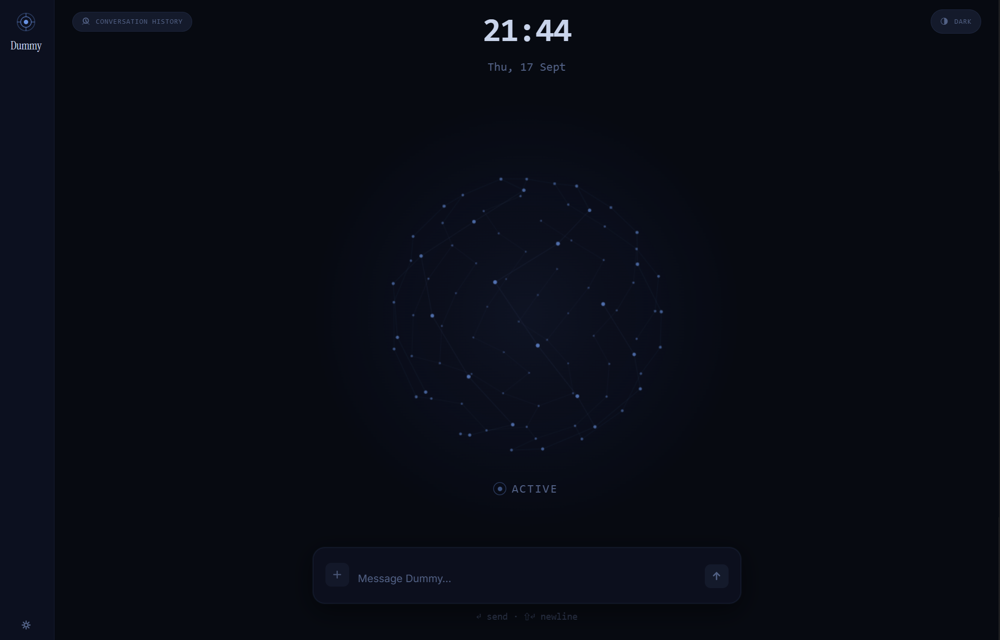
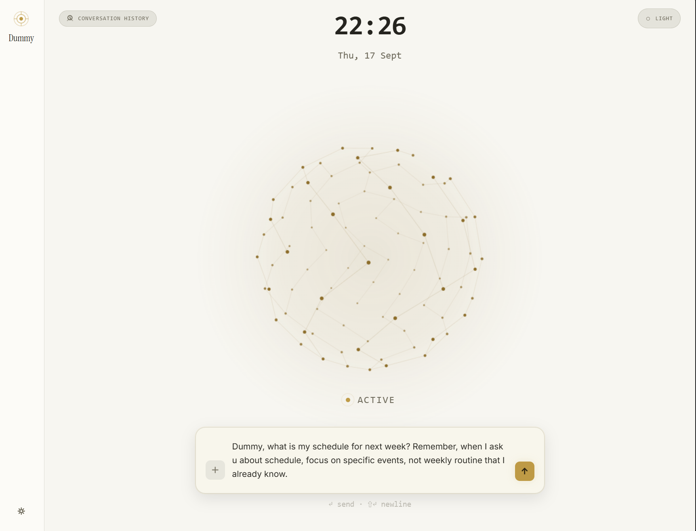
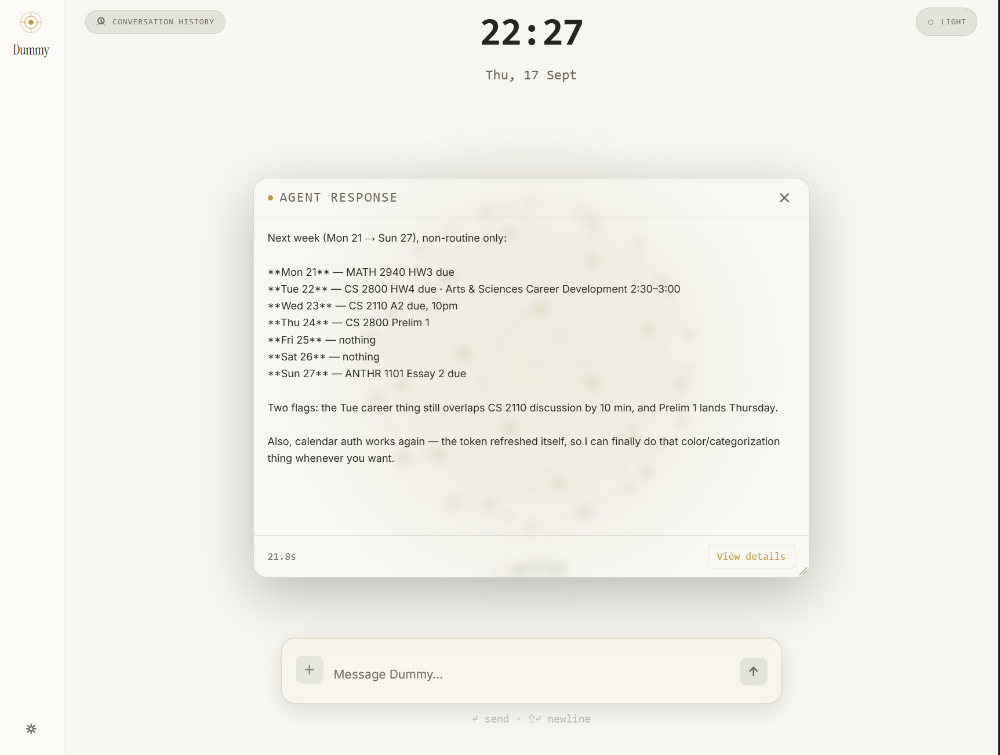
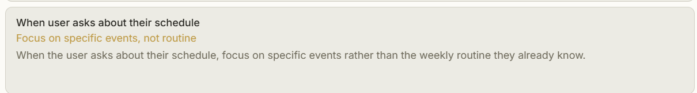
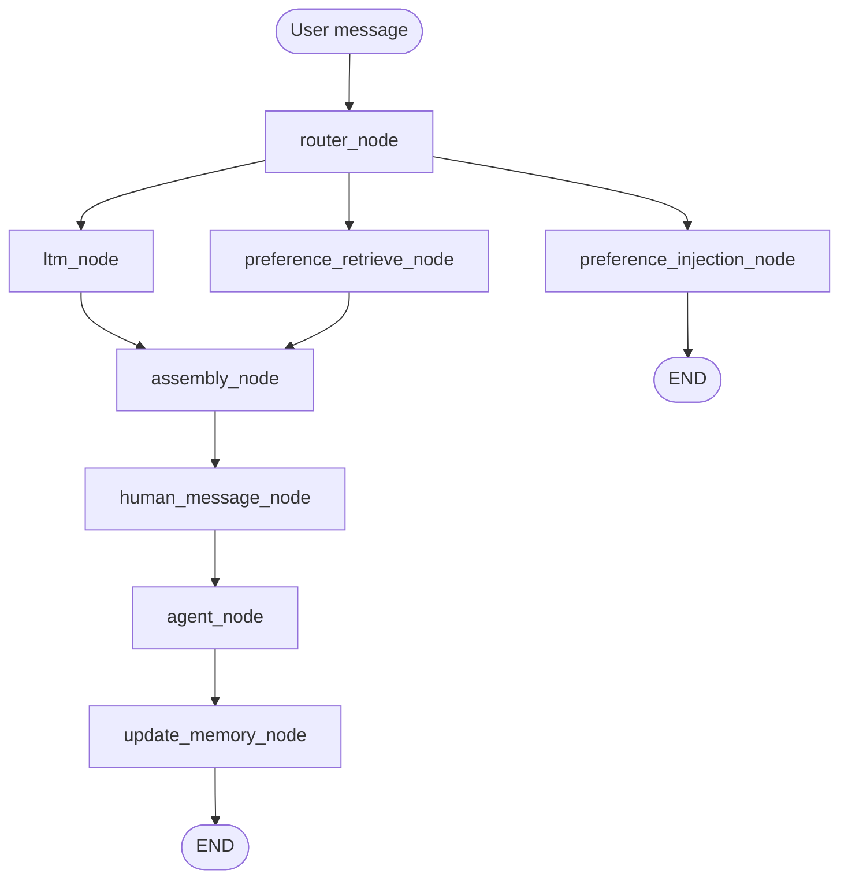

# Dummy Agent

Dummy is a maybe-not-very-helpful personal AI agent with memory, user preferences, and tool use.

It can remember things from past conversations, keep track of what you prefer, and use tools to actually do things instead of only generating a response.

  

## Why does Dummy exist?

Honestly, Dummy is mostly a learning project.

I started building it to learn about vibe-coding and agent engineering, and because having my own customizable AI assistant sounded pretty cool. I wanted to actually build one instead of just reading about how agents work.

I called it **Dummy** because, well, it's still pretty dumb and buggy.

The current version, **v0**, is a rough prototype rather than a finished agent. The design is still incomplete, and there are definitely things I would improve on as I learn more. I'm still developing it, so the project will probably change quite a bit in the future.

I'm also still pretty new to this field — I've been working on agent project for about three months. So this is basically what I've managed to build so far while figuring things out along the way.

## What can it do?

Specifically, Dummy can currently:

- Hold short-term conversation memory
- Recall relevant long-term memories from past conversations
- Record user preferences, facts, and ideas to provide more personalized responses
- Record user expectations to adjust how it responds and behaves
- Keep track of ongoing, changing information about the user
- Use tools to actually perform tasks instead of only responding with text
- Receive and process most common file and image inputs
- Provide a web GUI for interacting with and configuring the agent

## What does it look like?

The UI is a single screen — a clock, a central orb, and a composer. Everything
else (responses, history, settings) opens as a floating window on top of it.

**1. You type something.** Optionally drop in a file, or drag a past round in as
reference context.

**2. Dummy answers.** The reply opens as a draggable, resizable card instead of
being appended to a scrolling chat log.

**3. Every round is inspectable.** "View details" opens the execution detail behind
that response — here, the expectation Dummy recorded about the user while answering.

## How does it work?

Dummy is an agentic system built with LangChain / LangGraph. Its architecture
is mainly made up of three systems:

- **Memory** — manages short-term and long-term conversation memory.
- **Preferences** — stores information about the user, including notes,
  expectations, and ongoing states.
- **Tools & Workers** — lets Dummy perform tasks through specialized worker
  agents instead of directly exposing every tool to the main agent.

These systems are connected through the main agentic pipeline:

At a high level, a user message is routed to a relevant conversation thread,
while memory and preference retrieval happen in parallel. The resulting context
is assembled and given to Dummy, which can either respond, search its memory,
or delegate a task to a worker. After the interaction, the conversation and
relevant information are stored back into the memory system.

For a detailed explanation of the architecture and design decisions, see
[Architecture Documentation](Documentation.md).

## How do I run it?

Fair warning: this is a personal project, so I don't expect anyone to actually clone and run it.
Tested on Python 3.12 and Node 22.

### Setup

    pip install -r requirements.txt
    cd frontend && npm install

### Keys

Copy `.env.example` to `.env` and fill in what you need. `config.py` loads it with
`load_dotenv` at import, and a key already set in your OS environment takes precedence.

- `SILICONFLOW_API_KEY` — the small classification model the preference system uses
- `DEEPSEEK_API_KEY` — main model and image attachments
- `GIT_API_KEY`, `GOOGLE_OAUTH_CREDENTIALS` — optional, only for the GitHub / Calendar tool categories

### Models

Built and tested around DeepSeek V4 Flash as the main model and Qwen 3.5 9B via SiliconFlow as the
small assisting one. Since everything goes through LangChain's `init_chat_model`, another
OpenAI-compatible model should work — but the code is still crappy and parts of it assume DeepSeek,
so don't expect other models to behave consistently out of the box. See `workflow/llm.py`.

### Run

    python dev.py

UI → http://localhost:5173, API → http://127.0.0.1:8000. `python -m api.server`,
`cd frontend; npm run dev` and `python main.py` (CLI) also work standalone.

### Notes

- Open the UI and edit preferences / expectations from the settings tabs
- `web_search` needs a local SearXNG: `cd tool/searxng && docker compose up -d`
- shell and filesystem tools only operate inside `Dummy_Folder`
- nothing needs seeding — the app creates its own state on first run
- tests: `pip install -r requirements-dev.txt`, then `python -m pytest tests/ -q` (offline)

## What are the limitations?

As mentioned above, Dummy is still a rough prototype. There is a lot of room
for improvement, and there are also many things I want to experiment with in
the future.

### Current limitations

- **Expectation system maintenance** — The expectation system currently has
  limited capacity and is not designed for autonomous long-term maintenance.
  When there are more than 20 expectations, Dummy currently warns the user to
  clean them up manually.

- **Tool system customization** — Adding and managing tools is currently
  relatively complicated. This is also why the tool settings page in the UI
  is currently blank: there is not yet a simple way to manage tool categories
  through the GUI.

- **STM routing reliability** — The architecture relies heavily on the
  conversation-thread router. If it routes a message to the wrong thread,
  Dummy can receive the wrong context and produce a very wrong response.
  In other words, a bad routing decision can make Dummy genuinely "Dumb."

- **No learning from execution** — Dummy currently does not have a well-designed
  mechanism for learning from its own execution. It can encounter mistakes
  and failures, but it does not systematically learn from them or improve its
  future workflow and strategies.

- **Limited performance evaluation** — The current system does not have a
  structured way to evaluate its performance, especially over long periods of
  use. Its long-term performance has not been thoroughly examined yet.

### Possible future directions

Dummy currently has basic agent capabilities, but I have always wanted to
eventually make it more autonomous. I plan to focus on improving its ability to learn, make its own decisions,
and take actions without always requiring a direct user trigger or oversight.

Some things I might explore in the future:

- **Audio input and output** — Allow Dummy to have direct voice conversations
  instead of requiring everything to be typed. It sounds more convenient.

- **Dynamic tool management** — Give Dummy the ability to create and manage its
  own tool categories, search for published MCP tools, and potentially create
  its own tools.

- **Self-invocation** — Allow Dummy to initiate actions on its own instead of
  always waiting for a user message to trigger the system.

- **Execution system redesign** — Explore ways to reduce inefficient
  communication between Dummy and worker agents.

- **Skills for workers** — Give worker agents specialized skills or guidance
  based on their task type or assigned tool category. Currently, workers are
  fairly general-purpose and do not have specialized skills for the tasks they
  perform.

- **Parallel Worker Execution** — Dummy can assign multiple tasks within a single
ReAct turn, but the current worker design executes those workers sequentially
rather than concurrently. It is actually very doable, and parallel execution 
could significantly improve task execution efficiency. 

- **Long-term evaluation and iteration** — Continue testing Dummy over longer
  periods, observe how it performs in real use, and adjust the system based on
  what actually works and what doesn't.

These are ideas rather than a fixed roadmap. I'm still figuring out which
directions are actually worth pursuing.

## To learn more

Feel free to check out the [documentation](Documentation.md) for more
details about Dummy's system design and how the different components work
together.

If you have any questions, ideas, or advice, feel free to reach out to me at
**rich-hce@outlook.com**.
